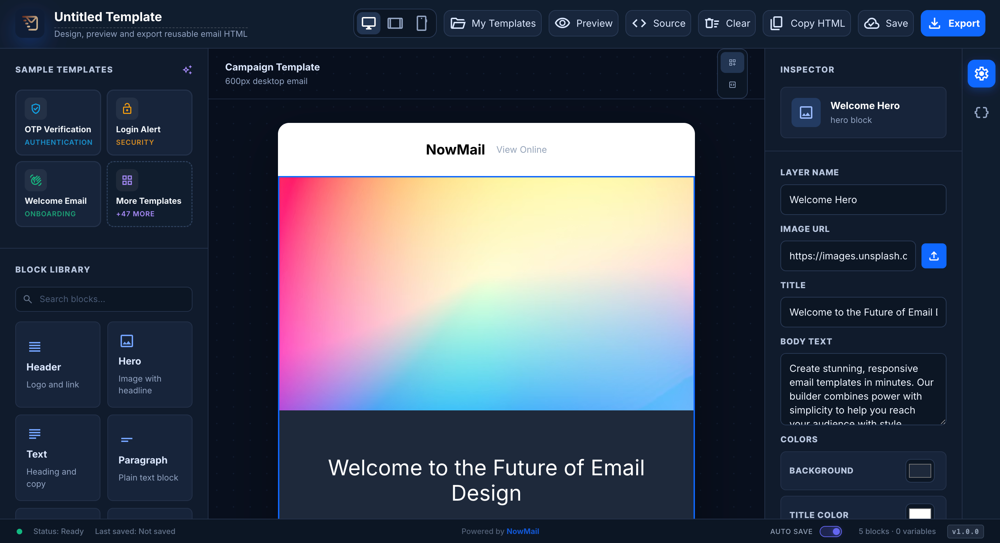
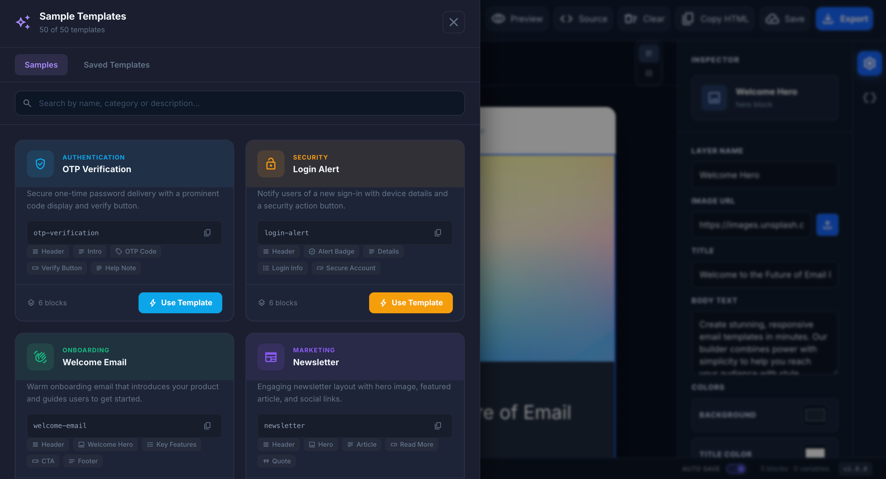
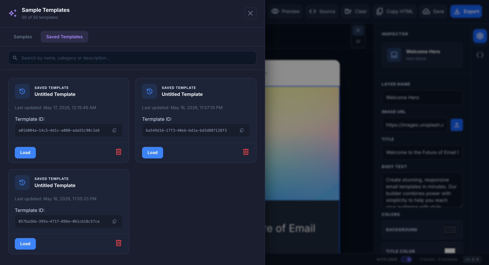

# Ngx-Email-Builder 📧



A premium, standalone email template builder for Angular applications. Build high-end, responsive email templates with a modern drag-and-drop interface.

## 📸 Screenshots

| Template Editor | Saved Templates |
| :---: | :---: |
|  |  |


## ✨ Features

- **🚀 Performance**: Built with Angular for speed and responsiveness.
- **📱 Responsive**: All blocks are mobile-first and look perfect on all screens.
- **🎨 Premium UI**: Modern, clean design with customizable themes.
- **🧩 Block-Based**: Large library of pre-built blocks (Hero, Text, Button, Social, etc.).
- **⚙️ Standalone Mode**: Works perfectly without any backend API.
- **💾 Export Options**: Export your designs as clean HTML or JSON.
- **💻 Monaco Editor**: Integrated high-performance code editor for advanced customization.
- **📁 Image Management**: Built-in support for base64 image injection.

---

## 📦 Installation

### Standard Installation (Any Angular Project)

Install the library via npm:

```bash
npm install ngx-email-builder
```

### Basic Setup

1. **Import the Component**:
   In your standalone component or NgModule:

```typescript
import { EmailTemplateBuilderComponent } from 'ngx-email-builder';

@Component({
  standalone: true,
  imports: [EmailTemplateBuilderComponent],
  template: `<ngx-email-builder></ngx-email-builder>`
})
export class MyEditorComponent {}
```

2. **Add Styles**:
   Ensure you have a theme or global styles that accommodate the builder.

---

## 🛠 Development & Local Setup

To contribute or run the demo locally from source:

### 1. Build the Library
```bash
# Install dependencies
npm install

# Build the library
npm run build
```

### 2. Run the Demo (Template Builder)
```bash
# Use the automated refresh command (builds, packs, and starts app)
npm run app:refresh
```

Navigate to `http://localhost:4200` to see the builder in action.

---

## 🤝 Contributing

We love contributions! Whether it's a bug report, a new feature, or documentation improvements.

1. Fork the Project
2. Create your Feature Branch (`git checkout -b feature/AmazingFeature`)
3. Commit your Changes (`git commit -m 'Add some AmazingFeature'`)
4. Push to the Branch (`git push origin feature/AmazingFeature`)
5. Open a Pull Request

---

## 🛡 License

Distributed under the MIT License. See `LICENSE` for more information.

## ✉️ Contact

Ashish Kumar - [@jd-ashish](https://github.com/jd-ashish)

Project Link: [https://github.com/jd-ashish/ngx-email-builder](https://github.com/jd-ashish/ngx-email-builder)
